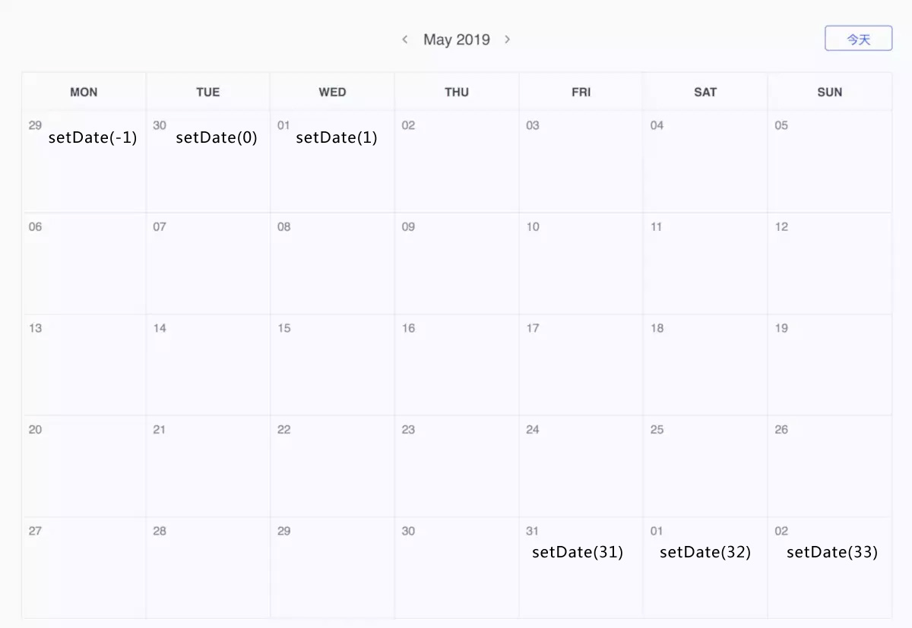

# 1.思路
>例子地址：https://www.tuicool.com/articles/vmaiei2
https://www.jianshu.com/p/d8ce25e9badb


## 1.1 Date 对象方法
```js
var date = new Date()

this.currentYear = date.getFullYear() //四位数年份
this.currentMonth = date.getMonth()+ 1 //月份 (0 ~ 11)
this.currentDay = date.getDate() //返回 (1 ~ 31日)
this.currentWeek = date.getDay() //星期(0 ~ 6 ，周日为0)
```

## 1.2 setDate(day)
>setDate() 方法用于设置一个月的某一天。
>表示一个月中的一天的一个数值（1 ~ 31）:
>>0 为上一个月的最后一天
>>-1 为上一个月最后一天之前的一天

>如果当月有 31 天:
>>32 为下个月的第一天,33为第二天

```js
var d = new Date();
d.setDate(15);
console.log(d)
//当月的15日 Fri May 15 2020 15:09:35 GMT+0800 (中国标准时间)
```
## 1.3 生成当月日历
>一个日历一页有的是42格有的是35格，原因是（6行x7天）或（5行x7天）；42天的优点是能全部展示出上个月，当前月以及下个月，缺点是上个月和下个月占比较多，有些冗余，如果是35天看起来就会比较精简，但有的月份就不能全部展示出来还是需要42天，这个也无伤大雅，我们就以35天为例



>首先找出本月的第一天是周几，图中5月1日是周三，我们要把这天放在第一行的第三格；因为一共只有35格，那么从5月1日第一天到最后一格有：35格 - ( 周三- 1 ) = 32格
>
>根据setDate()函数，我们可以很快的把本月和下月的所有日期获取出来：
```js
var d = new Date()
//从5月1日
d.setDate(1)
var day1 = d.getDate() //1 (5月1日)
//到6月2日
d.setDate(33)
var day33 = d.getDate() //2 (6月2日)
```
```js
// 1.4 把1日后面的日期补完，一共是35格，假如5月1日是周三，说明35格-周3 = 32格 是属于本月和下月的日期
for(var i=0; i<35-this.firstWeek; i++){
  var d = new Date()
  d.setDate(2+i) //下一步计算上月日也会重复计算5月1日这天，可以从2号开始
  console.log('本月下月日期：'+d.getDate())
  this.days.push(d)
}
```

## 1.4 上月的日历
>通过获取当月1日在第一行的位置,比如5月1日 星期三,说明前面还有3-1=2格式属于上个月的,因此,可以通过for循环,和setDate(0)~setDate(-1)得出第一行属于上个月的日子。

|i取值|星期|设置日期|
|---|---|---|
|i=0|星期3|setDate(1)|
|i=1|星期2|setDate(0)|
|i=2|星期1|setDate(-1)|

```js
// firstWeek=3，说明for循环需要循环3次，把周一到周三的日期获取
for(var i = 0; i<this.firstWeek; i++){
  var d = new Date()
  d.setDate(1-i)
  console.log('上个月日期：'+d.getDate())
  this.days.unshift(d)
}
```

# 2. 显示选择的日期
>我们设置了initData(cur)方法，可以填入日期参数，就会显示选择的日期；
>initData(cur)的参数填入格式为“yyyy/mm/dd”,因此创建fromatDate(year,month,day)方法格式化填如的日期。

>pick(year,month,day)方法把选择的日期提交到initData(str)

```js
// 2.选择年份月份
pick(year,month,day){
  var str = this.fromatDate(year,month,day)
  console.log(str)
  this.initData(str)
},

// 返回 类似 2020/01/02 格式的字符串
fromatDate(year,month,day){
  var y = year;
  var m = month;
  if (m < 10) m = "0" + m;
  var d = day;
  if (d < 10) d = "0" + d;
  return y + "/" + m + "/" + d
}
```
## 2.1 选择一下一个月或上一个月
>选获取当前日期，然后设置d.setDate(0)上月最后一天，或，d.setDate(32)下个月天数，然后输入initData(d)初始化说选日期。

```js
// 3.选择上个月
pickPre(){
  // 获取当前日期
  var str = this.fromatDate(this.currentYear,this.currentMonth,this.currentDay)
  var d = new Date(str)
  // 设置成上月最后一天
  d.setDate(0)
  // 通过初始化上个月最后一天，来渲染整个上个月日期
  this.initData(d)
},
// 3.选择下个月
pickNext(){
  // 获取当前日期
  var str = this.fromatDate(this.currentYear,this.currentMonth,this.currentDay)
  var d = new Date(str)
  // 设置成下月某天，一个月最多才31天，只要大于31就可以
  d.setDate(32)
  // 通过初始化下月第一天，来渲染整个上个月日期
  this.initData(d)
},
```


# 其它
## 1. arr.length = 0
>foo = [] 创建一个新的数组，并将对它的引用分配给变量。任何其他引用不受影响，但仍指向原始数组

>foo.length = 0 修改数组本身。如果通过不同的变量访问它，那么仍然可以获得修改后的数组

```js
var foo = [1,2,3];
var bar = [1,2,3];
var foo2 = foo;
var bar2 = bar;
foo = [];
bar.length = 0;
console.log(foo, bar, foo2, bar2); // [], [], [1, 2, 3], []
```

## 2. new Date()设置
>可以通过 new 关键词来定义 Date 对象,有四种方式初始化日期:
```js
new Date() // 当前日期和时间
new Date(milliseconds) //返回从 1970 年 1 月 1 日至今的毫秒数
new Date(dateString)
new Date(year, month, day, hours, minutes, seconds, milliseconds)
```
```js
var today = new Date()
var d1 = new Date("October 13, 1975 11:13:00")
var d2 = new Date("2010/05/12")
var d3 = new Date(79,5,24,11,33,0)

console.log(today) 
console.log(d1)
console.log(d2)
console.log(d3)

//  Mon May 11 2020 16:10:18 GMT+0800 (中国标准时间)
//  Mon Oct 13 1975 11:13:00 GMT+0800 (中国标准时间)
//  Wed May 12 2010 00:00:00 GMT+0800 (中国标准时间)
//  Sun Jun 24 1979 11:33:00 GMT+0800 (中国标准时间)
```

>其中我们常用new Date(dateString)来设置：
```js
xxxx-xx-xx xx:xx:xx
// chrome firefox opera

xxxx/xx/xx xx:xx:xx
// chrome firefox opera safari ios（苹果手机只认此格式）

xxxx.xx.xx xx:xx:xx
// chrome opera

// 建议使用 xxxx/xx/xx xx:xx:xx
```
