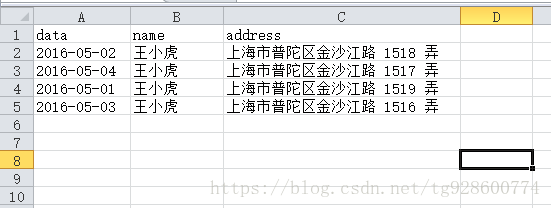

[toc]

# 简介
>这是一个用 vue-cli + element-ui 搭建的信息管理界面，后期会添加php后端服务器，运用axios 传递数据,现阶段使用json-server来模拟服务器和数据库。

原文：https://www.cnblogs.com/zhoulifeng/p/9900564.html

# 启动例子
>先启动json-server服务器,在项目文件夹中执行：
```bash
json-server --watch db.json
```
>再打包vue
```bash
#开发模式
npm run server

#或 生产打包
npm run build

```

# 预备工作
>安装vue-cli,
```bash
#如果之前已经全局安装了，就不用再安装了
npm install -g @vue/cli
```

>然后看能不能跑起来
```bash
#开发环境运行
npm run serve
```

# 安装element-ui
>npm 安装
```
npm i element-ui -S
```
>在全局中引入element-ui
```js
//main.js

import Vue from 'vue';
import ElementUI from 'element-ui';
import 'element-ui/lib/theme-chalk/index.css';

```

# 1.创建 UserInfo.vue
>运用Element-ui的表格来布局，运用了:
>layout:\<el-row> \<el-col>
>table: \<el-table> \<el-table-column>

## 1.1 Element-ui中的slot 插槽
>在Element-ui(2.13.2)中,table表格可以运用插槽`“slot-scop”`，给table中的单元格插入html模板，但是vue在2.x版本后就即将废除`“slot-scop”和“slot”`转而改用`v-slot`

```html
<el-table-column  
  label="姓名" 
  width="100"
  align="center">
  <template v-slot="scope">
    <span>{{ scope.row.name }}</span>
  </template>
</el-table-column>

<!--
  scope可以获取到tableData中的数据
-->
```

### 1.1.1 vue中的插槽

>先看看vue中`v-slot`的用法，正常引入子组件：
```html
<!--  son.vue 子组件 -->
<template>
  <h1>this is son</h1>
</template>
```
```html
<!--  father.vue父级组件中引入子组件 -->
<son></son>
```
>如果我们想在son子组件中插入一段html，可以用v-slot：
```html
 <!-- son.vue 子组件 -->
<template>
  <h1>this is son</h1>
  <slot v-bind:user="user"><slot>
</template>

<script>
...
data(){
  user:{
    name:"peter",
    age:18,
  }
}
...
</script>
<!-- 
1.<slot>称作插槽，用来插入v-slot中的内容
2.在<slot>中绑定的对象 v-bind:user="user" ，会被存储在“插槽 prop”的一个集合 
-->
```
```html
<!-- father.vue父级组件中引入子组件 -->
<son>
  <template v-slot:default="slotProps">
    <h2>this is insert ,{{ slotProps.user.name }}</h2>
  </template>
</son>
<!-- 
1. v-slot模板中的内容会插入到son.vue的<slot>插槽中
2. v-slot:default="slotProps"，绑定了默认插槽（default），并传入了“插槽 prop”（slotProps ，一个包含了所有从子组件中<slot v-bind:xxx="xxx">中绑定的数据），达到了在父级组件中获取到了子组件中数据的目的
-->
```
>结果father.vue将渲染出html页面：
```html
<!-- father.vue渲染后 -->
<h1>this is son</h1>
<h2>this is insert ,peter</h2>
```
>通过例子我们知道在vue2.x版本后，官方提倡使用v-slot来代替旧有的方法，把 父级`v-slot` 中的内容，插入到子组件的`<slot>`插槽中
>
>而在`<slot v-bind:user="user"><slot>`中绑定的对象，会传入到一个“插槽 prop”集合（`slotProps`），我们可以在 `v-slot:default="slotProps" `中获取这个对象，从而达到父级组件获取子组件中数据的目的。
>
>`注意：`
>1.用着默认插槽时，v-slot可以简写省略绑定名default
>2.v-slot="slotProps" 这个slotProps可以使用任意你喜欢的名字，因为它本质只是一个函数的传参数名而已。
```html
<template v-slot:default="slotProps"></template>

<!-- 默认插槽可以简写 -->
<template v-slot="slotProps"></template>
```
### 1.1.2 Element-ui中table的插槽
>Element-ui 文档写着：通过 Scoped slot 可以获取到 row, column, $index 和 store（table 内部的状态管理）的数据。
>
>我们可以理解为：tableData是给到table的记录集，scope是table内部基于tableData生成出来的，我们可以用Excel描绘一下

>我们传进去的tableData，在table内部生成了类似于Excel的scope，因此，通过scope.row.date，我们就可以读取到每一行中的date。

# 1.2 db.js 临时数据库文件
>按道理，本例子应该要用数据库来保存数据，但我们先不搭数据库，而是把数据存在vuex的store中，等前端页面搭建完成后，再把数据已到真正地数据库。
>
>这次我们选择流行的json格式来保存数据
```js
state: {
  db:[
    { 
      "date":"2019-01-01",
      "name":"peter1",
      "email":"peter1@qq.com",
      "title":"title",
      "evaluate":"evaluate",
      "state":"state",
      "id":1
    },
    { 
      "date":"2019-01-02",
      "name":"peter2",
      "email":"peter2@qq.com",
      "title":"title",
      "evaluate":"evaluate",
      "state":"state",
      "id":2
    },
    { 
      "date":"2019-01-03",
      "name":"peter3",
      "email":"peter3@qq.com",
      "title":"title",
      "evaluate":"evaluate",
      "state":"state",
      "id":3
    }
  ]
},

```

# 2.创建AddUserInfo.vue
>当点击添加信息按钮时，出行AddUserInfo.vue，可以填入新增信息。

## 2.1 dialog组件
>Element-ui组件，Dialog 对话框在保留当前页面状态的情况下，弹出一个对话框，告知用户并承载相关操作。
>
>dialog需要设置`visible`属性,如果为true，显示对话框，否则不显示；
>Dialog 分为两个部分：body和footer，footer需要具名为footer的slot

```html
<el-dialog 
title="添加用户信息" 
:visible.sync="dialogVisible">
  <el-form>
    表单内容
  </el-form>

  <template v-slot:footer>
    额外插入的底部内容
  </template>
</el-dialog>
```
## 2.2 dialog中的form组件
>dialog只是控制弹出对话框面板，而我们需要的是弹出填写表单，于是写法如下：
```html
<!--dialog中的表单-->
<el-form
:model="formDate"     //表单数据集合对象
ref="formAdd"        //这个表单自己的DOM
label-width="100px"   //标题宽度
:rules="formrules">   //这个表单有验证规则
  <!--日历组件-->
  <el-form-item label="日期" prop="date">
    <el-date-picker
    v-model="formDate.date"
    type="date"
    placeholder="选择日期">
    </el-date-picker>
  </el-form-item>
  <!--普通输入框-->
  <el-form-item label="姓名" prop="name">
    <el-input v-model="formDate.name"></el-input>
  </el-form-item>
  ...
</form>

data(){
  return{
    formDate:{
      date:'', 
      name:'',
      ...
    },
  }
}

```
>vue组件中的data`一定要有存载表单数据的对象（例子中是formDate）`,不然画面会渲染失败。

## 2.3 在UserInfo中引入AddUserInfo
>因为要在父级UserInfo中点击按钮来弹出AddUserInfo中的dialog，意思就是要在`父级` 控制 `子组件` 的“:visible.sync=true/false”,所以就要用`Prop父组件向子组件传递数据`:

```html
<!-- AddUserInfo.vue -->
<el-dialog 
title="添加用户信息" 
:visible.sync="dialogAdd.show"> //控制是否弹出对话框
...
</el-dialog >


<script>
export default {
  prop:["dialogAdd"]  //获取父级传给的数据
}
</script>
```
```html
<!-- UserInfo.vue -->

<!-- 添加按钮 -->
<el-form-item style="float: right">
  <el-button type="primary" size="small" icon="el-icon-edit-outline" @click="handleAdd">添加</el-button>
</el-form-item>

<!-- 引入AddUserInfo组件,并向子组件传递dialogAdd -->
<AddUserInfo :dialogAdd="dialogAdd" ></AddUserInfo>


<script>
//引入AddUserInfo组件
import AddUserInfo from './AddUserInfo.vue' 


data(){
  return{
    dialogAdd:{   //控制弹出表单
      show:false
    }
  }
},
components:{
  AddUserInfo, //注册AddUserInfo组件
},
methods:{
  //点击“添加按钮”，弹出表单
  handleAdd(){
    console.log("ok")
    this.dialogAdd.show = true
  },
}
</script>
```
## 2.4 点击“确定”提交添加数据
>当dialog中填写完数据，点击“确定”执行
>@click="dialogFormAdd('formAdd')"
>`检查表单数据`并`提交数据`
>`检查表单数据`待会再说，先说`提交数据`

### 2.4.1 提交数据
>element-ui 中表当对象有一个`validate方法`
>validate:
>>对整个表单进行校验的方法，参数为一个回调函数。该回调函数会在校验结束后被调用，并传入两个参数：是否校验成功和未通过校验的字段。若不传入回调函数，则会返回一个promise
>>obj.validate(callback: Function(boolean, object))

```js
methods:{
    // 点击“确定”检查验证规则，无误后提交表单数据到数据库
    dialogFormAdd(formAdd){
      // validate接收一个回调函数，检查表单，无问题返回true，有问题返回false，并返回obj错误的信息
      this.$refs[formAdd].validate((valid,obj)=>{
        if(valid){
          //触发store中的追加数据功能
          this.$store.commit('add',this.formDate); 
          this.dialogAdd.show = false; //关闭弹窗
          this.formDate  = {  //提交后清空
            date:'', 
            name:'',
            email:'',
            title:'',
            evaluate:'',
            state:''
          }
          console.log('添加信息成功');
        }else{
          console.log('error submit!!');
          return false;
        }
      })
    }
  }
```
### 2.4.2 检查表单数据
>Form 组件提供了表单验证的功能，只需要通过 rules 属性传入约定的验证规则，并将 Form-Item 的 prop 属性设置为需校验的字段名即可。校验规则参见 async-validator(看了也不懂，按例子改写就好)
```html
<!-- AddUserInfo.vue -->
<el-form
:model="formDate" 
ref="formAdd" 
label-width="100px" 
:rules="formrules"> //绑定formrules 规则对象

  //prop 属性设置为需校验的字段名
  <el-form-item label="姓名" prop="name"> 
    <el-input v-model="formDate.name"></el-input>
  </el-form-item>
</el-form>

<!-- 在data中设置规则 -->
<!-- 
  required:true 为必填
  message:"日期不能为空" 检验没有填入时显示的文字
  trigger:"blur"  当光标离开时触发检验
 -->
data(){
  return{
    formrules:{
      date:[{required:true,message:"日期不能为空",trigger:"blur"}],
      name:[{required:true,message:"用户名不能为空",trigger:"blur"}],
      email:[{required:true,message:"邮箱不能为空",trigger:"blur"}],
    }
  }
}
```
# 3.删除功能
>删除数据需要根据id去删除
>scope为通过v-slot=“scope”根据element-ui处理出来的，一行数据的集合，scope中包含 row（数据对象）, column, $index（这行数据的索引） 和 store（table 内部的状态管理）的数据。
```html
<!--UserInfo.vue-->
<el-button
size="mini"
type="danger"
@click="handleDelete(scope.$index, scope.row)">
  删除
</el-button>

<script>
// 点击“删除按钮”
handleDelete(index, row){
  this.$store.commit("delete",row.id) //触发store中的删除功能
}
</script>
```
>点击每行的“删除按钮”，会触发handleDelete方法，传入的是这行数据的索引，和数据对象。
>然后，我们根据数据对象中的id号去删除。
```js
//store.js

// 删除数据，根据id删除
delete(state,id){
  let arr = state.db
  for(let i=0;i<arr.length;i++){
    if(arr[i].id === id){
      arr.splice(i,1)
      console.log("删除id:"+id)
    }
  }
},
```

# 4.编辑功能 EditUser.vue
>在这里添加弹出框内容和编辑弹出框内容一模一样，可以选择进行封装，封装成一个组件，添加和编辑共同使用这一个组件，根据自定义一个字段来判断点击 的是添加还是编辑按钮。在本次案例中，没有封装.
>
>新建一个和EditUser.vue组件，内容与AddUserInfo.vue 大致一样

## 4.1 编辑时父组件传递编辑数据
>在父组件中定义需要传递的数据，引用子组件时绑定属性
```html
<!-- UserInfo.vue -->

<EditUserInfo :dialogEdit="dialogEdit" :formDate="formDate"></EditUserInfo>

<script>
dialogEdit:{   //控制编辑弹出表单
  show:false
},
formDate:{ //点击“编辑”获取数据，传递给子组件
  date:'', 
  name:'',
  email:'',
  title:'',
  evaluate:'',
  state:''
},
</script>
```
## 4.2 点击显示面板,并获取数据
>与AddUserInfo一样，改变dialogEdit.show:true/false即可
```js
// UserInfo.vue

handleEdit(idnex, row){
  this.dialogEdit.show = true
  this.formDate = { //获取数据，传递给子组件
    date:row.date,
    name:row.name,
    email:row.email,
    title:row.title,
    evaluate:row.evaluate,
    state:row.state,
    id:row.id
  }
}
```

## 4.3 点击确认，传递新数据给store
>把数据传给store，store根据id号 .splice拼接新的数据。 
```js
// EditUserInfo.vue

// 点击“确认按钮”
dialogFormAdd(formEdit){
  // 先验证表单规则,valid=true 通过验证
  this.$refs[formEdit].validate((valid,obj)=>{
    if(valid){
      // 把新数据传给store，store通过id号替换数据
      this.$store.commit("edit",this.formDate)
      this.dialogEdit.show = false;
    }else{
      console.log('error submit!!');
      return false;
    }
  })
}
```
```js
// store.js

// 编辑数据，根据id号替换数据
edit(state,formDate){
  let arr = state.db
  for(let i=0;i<arr.length;i++){
    if(arr[i].id === formDate.id){
      arr.splice(i,1,formDate)
      console.log("修改id:"+arr[i].id)
    }
  }
}
```
# 5.查询用户信息
>用vue的filters 可以设置过滤规则，通过javascript方法filter对数组进行过滤， 最后通过es6中includes方法，判断查询的条件是否包含，includes如果包含就返回true，如果不包含就返回false,
```html

<el-form-item style="float: left" label="查询用户信息:">
  <el-input v-model="keyUser" placeholder="查询所需要的内容......"></el-input>
</el-form-item>

<!-- 表格 -->
<!-- tableData会作为第一参数传给userFilter，而 this.keyUser会默认作为第二参数-->
<el-table :data="tableData | userFilter(this.keyUser)" border style="width: 100%">
...
</el-table>

<script>
// 过滤规则
// filter、includes是javascript的数组方法
filters:{
  userFilter(db,keyUser){
    return db.filter((user)=>{
      if(user.name.includes(keyUser)){
        return user
      }
    })
  }
}
</script>

```


# 6. 搭建json-server服务器
```bash
npm install -g json-server
#全局安装
```
```bash
json-server --watch db.json
#在当前文件夹启动服务器
#并监控当前文件夹的 db.json 文件
```
## 6.1 创建db.json文件
```json
{
  "users":[
    { 
      "date":"2019-01-01",
      "name":"peter1",
      "email":"peter1@qq.com",
      "title":"title",
      "evaluate":"evaluate",
      "state":"state",
      "id":1
    },
    { 
      "date":"2019-01-02",
      "name":"peter2",
      "email":"peter2@qq.com",
      "title":"title",
      "evaluate":"evaluate",
      "state":"state",
      "id":2
    },
  ]
}
```
# 7.安装axios

>axios 和 vue-axios是有区别的
## 7.1 axios
>axios是一个库，并不是vue中的第三方插件，使用时不能通过Vue.use()安装插件，需要在原型上进行绑定：
```bash
$cnpm install --save axios  #安装
```
在mian.js中引用axios，并邦到原型链上。使用插件的时候，一般要在入口文件main.js中引入，因为mian.js是项目首先运行的文件：
```js
import Vue from 'vue'
import axios from 'axios'
Vue.prototype.$axios = axios //绑定到全局 使用 this.$axios
```

## 7.2 vue-axios
>vue-axios是将axios集成到Vue.js的小包装器，可以像插件一样进行安装
```bash
$cnpm install --save axios vue-axios  #安装
```
在mian.js中引用axios，vue-axios，通过全局方法 Vue.use() 使用插件，就相当于调用install方法：
```js
import Vue from 'vue'
import axios from 'axios'
import VueAxios from 'vue-axios'
Vue.use(VueAxios, axios)
```
使用：
```js
Vue.axios.get(api).then((response) => {
  console.log(response.data)
})
 
this.axios.get(api).then((response) => {
  console.log(response.data)
})
 
this.$http.get(api).then((response) => {
  console.log(response.data)
})
```

# 8.把数据改到json-serve服务器
>json-server 是一个mock模拟服务器，基于express，通过web的响应方式（get、post），处理json数据，json-server是根据id号来处理数据的，因此，如果存入的数据没有id号，他会默认自增。
## 8.1 获取数据
>搭建好json-serve服务器后，在 UserInfo.vue 载入时通过axios获取db.json数据,并传入store，UserInfo.vue 通过computed监控store数据变化
```js
// UserInfo.vue

// 监控store中的数据变化
computed:{
  tableData(){
    return this.$store.state.db //临时数据库
  }
},

//载入时，通过axios向json服务器获取数据，返回对象的.data就是我们在db.json的数据 
methods:{
  // 获取数据库数据,把数据更新到store
  getData(){
    this.$axios({
      method:"get",
      url:'http://localhost:3000/users'
    })
    .then((response) =>{          //这里使用了ES6的语法
      console.log(response.data)       //请求成功返回的数据
      this.$store.commit('getdata',response.data) //把获取到的数据保存在store中
    })
    .catch((error) =>{
      console.log(error)
    })
  }
},
mounted(){
  this.getData()
}
```
## 8.2 添加数据
>在原本的 AddUserInfo.vue 的添加数据功能，改为通过axios的post功能，把要保持的数据添加到 data对象中，就可以把数据保存到json-server中。 
>保存好后，要执行一次上面8.1步的 getData() 获取数据功能，把更新后的db.json数据，获取到store中。这里用到父传子事件，用 @getdata='getData' 绑定，$emit("getdata")触发
```html
<!-- UserInfo.vue -->
<!-- 把 UserInfo.vue 中的 getData 传给子组件 AddUserInfo.vue 的 getdata 事件-->
<AddUserInfo :dialogAdd="dialogAdd" @getdata='getData'></AddUserInfo>
```
```js
//AddUserInfo.vue

methods:{
  // 点击“确定”检查验证规则，无误后提交表单数据到数据库
  dialogFormAdd(formAdd){
    // validate接收一个回调函数，检查表单，无问题返回true，有问题返回false，并返回obj错误的信息
    this.$refs[formAdd].validate((valid,obj)=>{
      if(valid){
        
        // //触发store中的追加数据功能
        // this.$store.commit('add',this.formDate); 
        // this.dialogAdd.show = false;
        // this.formDate  = {  //提交后清空
        //   date:'', 
        //   name:'',
        //   email:'',
        //   title:'',
        //   evaluate:'',
        //   state:''
        // }

        this.$axios({
          method:"post",
          url:'http://localhost:3000/users',
          data:this.formDate //保存的数据
        }).then((res)=>{
          console.log(res) //返回上面保存的数据
          this.dialogAdd.show = false; //关闭面板
          this.formDate  = {  //提交后清空
            date:'', 
            name:'',
            email:'',
            title:'',
            evaluate:'',
            state:''
          } 
          this.$emit("getdata") //触发父组件传过来的事件，刷新store数据
        }).catch((err)=>{
          console.log(error)
        })

        console.log('添加信息成功');
      }else{
        console.log('error submit!!');
        return false;
      }
    })
  }
},
```

## 8.3 改写编辑功能
>原本编辑功能只是修改store中的数据（edit方法），现在有了json-server服务器，我们可以直接修改数据库中的数据，然后更新store中的数据。原本store中的edit方法可以删除了
```js
//EditUserInfo.vue

methods:{
  // 点击“确认按钮”
  dialogFormAdd(formEdit){
    // 先验证表单规则,valid=true 通过验证
    this.$refs[formEdit].validate((valid,obj)=>{
      if(valid){
        // // 把新数据传给store，store通过id号替换数据
        // this.$store.commit("edit",this.formDate)
        // this.dialogEdit.show = false;

        // 通过$axios 修改数据
        this.$axios({
          method:"patch",
          url:'http://localhost:3000/users/'+this.formDate.id, //根据id号patch替换
          data:this.formDate
        })
        .then((res)=>{
          console.log(res)
          this.dialogEdit.show = false;
          this.$emit("getdata") //父组件传过来的事件，刷新store数据
        })
        .catch((err)=>{
          console.log(err)
        })
      }else{
        console.log('error submit!!');
        return false;
      }
    })
  }
},
```
## 8.4改写删除功能
>原本点击删除按钮，是通过触发store中的delete方法更具id删除的，现在因为是json-server的，可以直接通过axios删除数据，然后更新store中的数据
```js
//UserInfo.vue

// 点击“删除按钮”
handleDelete(index, row){
  // this.$store.commit("delete",row.id) //触发store中的删除功能

  this.$axios({
    method:'delete',
    url:'http://localhost:3000/users/'+row.id,
  })
  .then((res)=>{
    console.log(res)
    this.getData() //获取数据，刷新页面
  })
  .catch((err)=>{
    console.log(err)
  })
},
```


# 其他
## 关闭ESlint
>创建vue.config.js文件,保存好后重新打包
```js
module.exports = {
  lintOnSave:false,
  devServer: {
    overlay:{
      warning:false,
      errors:false
    },
  }     
}
```

## axios 和 vue-axios是有区别的
